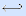
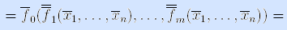

#### Вопрос 11

##### Понятие двойственности формул алгебр высказываний и предикатов. Теоремы о двойственных формулах (формулировка для обоих случаев, доказательство для формул алгебры высказываний).

**Определение.** Формула $F^*$ называется *двойственной формуле* $F$, если она получена из $F$ заменой символов функций на символы двойственных им функций.

**Пример.**

F = x ↓ (y  (x  y z) ) ( y  x ),

F* = x / (y  x (y  z))  ( y  x ). •

**Теорема** (*принцип двойственности*). Если формула $F$ задает булеву функцию $f(x_1, …, x_n)$, то двойственная ей формула $F^*$ задает двойственную функцию $f^*(x_1, …, x_n)$.

Доказательство. По условию теоремы формула $F$ задает булеву функцию $f(x_1, …, x_n)$. По определению формулы $F$ имеем:

$F=f(x_1, …, x_n) = f_0(f_1(x_1, …, x_n), …, f_m(x_1, …, x_n))$.

Рассмотрим двойственную ей формулу:

$F^*= f^*_0(f^*_1(x_1, …, x_n), …, f^*_m(x_1, …, x_n))=$

[ по определению двойственной функции для $f^*_i(x_1, …, x_n), i=1, …, m $]

$=f^*_0(\bar f_1(\bar x_1, …,\bar x_n), …,\bar f_m(\bar x_1, …,\bar x_n))=$

[ по определению двойственной функции для $f^*_0(y_1, …, y_m) $]

[ по закону двойного отрицания ]

=$\bar f_0(f_1(\bar x_1 …,\bar x_n), …, f_m(\bar x_1, …,\bar x_n))= \bar f(\bar x_1, …,\bar x_n) =$

[ по определению двойственной функции для $f(x_1, …, x_n)$ ]

$=f^*(x_1, …, x_n)$.

**Следствие из принципа двойственности.** Если формулы $F_1$ и $F_2 $равносильны, то двойственные им формулы $F^*_1$ и $F^*_2$, также равносильны.

*Доказательство.* Равносильные формулы $F1$ и$ F2$ задают одну и ту же булеву функцию $f(x_1, …, x_n)$, следовательно, по принципу двойственности, двойственные им формулы $F^*_1$ и $F^*_2$, задают двойственную $f(x_1, …, x_n)$ функцию $f^*(x_1, …, x_n)$.

Таким образом, можно не доказывать некоторые равносильности (в том числе и основные), а выводить их, пользуясь следствием из принципа двойственности.

