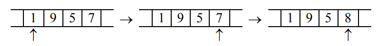
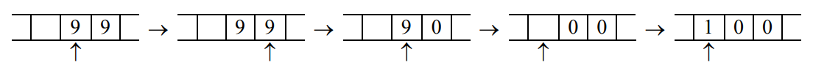
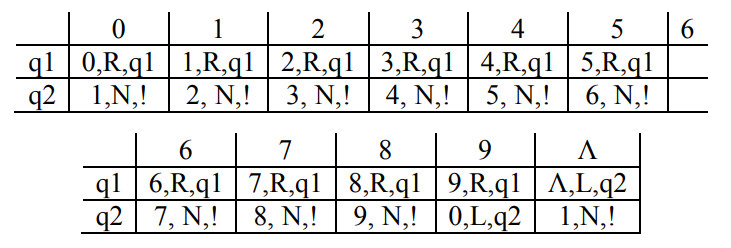

#### Вопрос 55

##### Машины Тьюринга: определения, примеры

В состав машины Тьюринга входит неограниченная в обе стороны лента, разделённая на ячейки, и управляющее устройство (также называется головкой записи-чтения (ГЗЧ)), способное находиться в одном из множества состояний. Число возможных состояний управляющего устройства конечно и точно задано.

Управляющее устройство может перемещаться влево и вправо по ленте, читать и записывать в ячейки символы некоторого конечного алфавита. Выделяется особый пустой символ, заполняющий все клетки ленты, кроме тех из них (конечного числа), на которых записаны входные данные.

Управляющее устройство работает согласно правилам перехода, которые представляют алгоритм, реализуемый данной машиной Тьюринга. Каждое правило перехода предписывает машине, в зависимости от текущего состояния и наблюдаемого в текущей клетке символа, записать в эту клетку новый символ, перейти в новое состояние и переместиться на одну клетку влево или вправо. Некоторые состояния машины Тьюринга могут быть помечены как терминальные, и переход в любое из них означает конец работы, остановку алгоритма.

Конкретная машина Тьюринга задаётся перечислением букв алфавита $A$, множеством состояний $Q$ и набором правил перехода, по которым работает машина. Они имеют вид: $q_ia_j\rightarrow q_{i_1}a_{j_1}d_k$ (если головка находится в состоянии $q_i$, а в обозреваемой ячейке записана буква $a_j$, то головка переходит в состояние $q_{i_1}$, в ячейку вместо $a_j$ записывается $a_{j_1}$, головка делает движение $d_k$, которое имеет три варианта: на ячейку влево, на ячейку вправо, остаться на месте). Для каждой возможной конфигурации $<q_i, a_j>$ имеется ровно одно правило. Правил нет только для заключительного состояния, попав в которое, машина останавливается. Кроме того, необходимо указать начальное и конечное состояния, начальную конфигурацию на ленте и расположение головки машины.

Пример: (перемещение автомата, замена символов) 

$A=\{0,1,2,3,4,5,6,7,8,9\}$. Пусть $P$ – непустое слово; значит, $Р$ – это последовательность из десятичных цифр, т.е. запись неотрицательного целого числа в десятичной системе. Требуется получить на ленте запись числа, которое на 1 больше числа $P$. 

Решение:

Для решения этой задачи предлагается выполнить следующие действия: 

1. Перегнать автомат под последнюю цифру числа. 
2. Если это цифра от 0 до 8, то заменить её цифрой на 1 больше и остановиться; например:

3. Если же это цифра 9, тогда заменить её на 0 и сдвинуть автомат к предыдущей цифре, после чего таким же способом увеличить на 1 эту предпоследнюю цифру; например:

4. Особый случай: в $P$ только девятки (например, 99). Тогда автомат будет сдвигаться влево, заменяя девятки на нули, и в конце концов окажется под пустой клеткой. В эту пустую клетку надо записать 1 и остановиться (ответом будет 100):

В виде программы для МТ эти действия описываются следующим образом:

Пояснения. (если кому не похуй)

$q_1$ – это состояние, в котором автомат «бежит» под последнюю цифру числа. Для этого он всё время движется вправо, не меняя видимые цифры и оставаясь в том же состоянии. Но здесь есть одна особенность: когда автомат находится под последней цифрой, то он ещё не знает об этом (ведь он не видит, что записано в соседних клетках) и определит это лишь тогда, когда попадёт на пустую клетку. Поэтому, дойдя до первой пустой клетки, автомат возвращается назад под последнюю цифру и переходит в состояние q2 (вправо двигаться уже не надо). $q_2$ – это состояние, в котором автомат прибавляет 1 к той цифре, которую видит в данный момент. Сначала это последняя цифра числа; если она – в диапазоне от 0 до 8, то автомат заменяет её цифрой, которая на 1 больше, и останавливается. Но если это цифра 9, то автомат заменяет её на 0 и сдвигается влево, оставаясь в состоянии $q_2$. Тем самым, он будет теперь прибавлять 1 к предыдущей цифре. Если и эта цифра равна 9, то автомат заменяет её на 0 и сдвигается влево, оставаясь по-прежнему в состоянии $q_2$, т.к. должен выполнить то же самое действие – увеличить на 1 видимую цифру. Если же автомат сдвинулся влево, а в видимой клетке нет цифры (а есть «пусто»), то он записывает сюда 1 и останавливается.