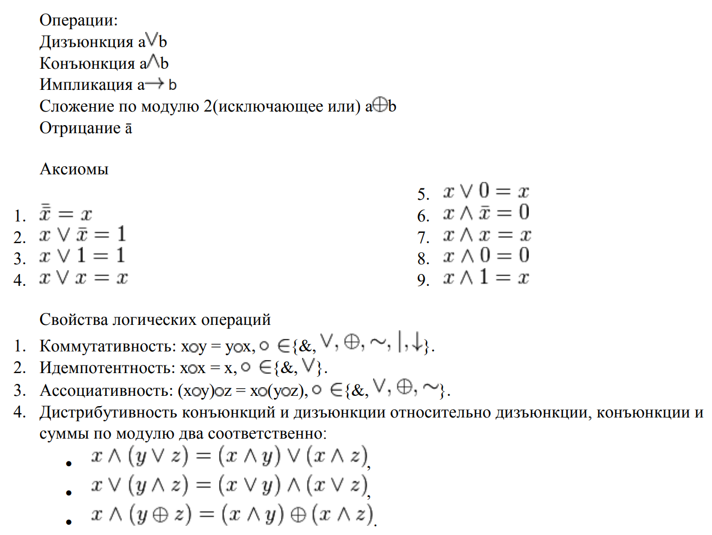
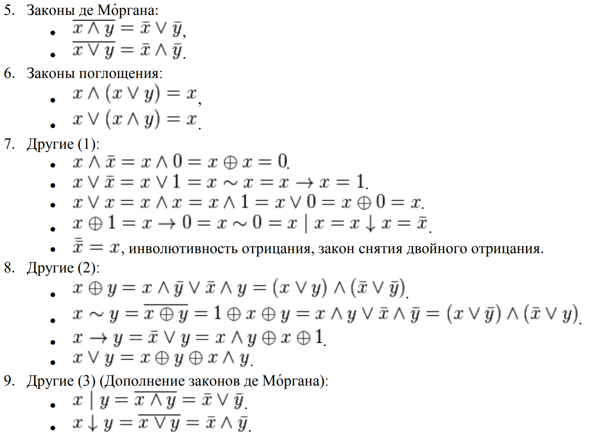
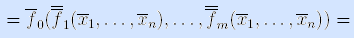
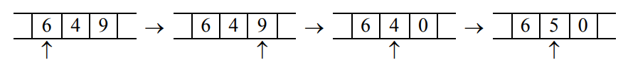
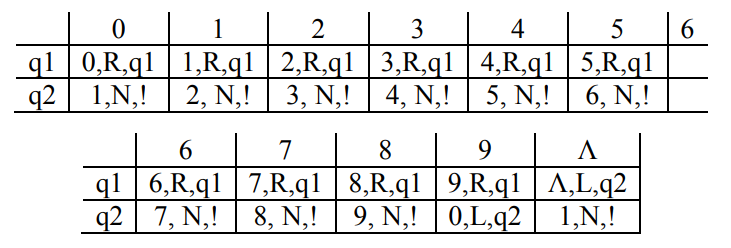

#### Вопрос 01

##### Операции над высказываниями и их свойства. Ассоциативность, дистрибутивность и идемпотентность операций алгебры высказываний.

#### Вопрос 02

##### Формулы алгебры высказываний. Подформулы. Тождественные и равносильные формулы

Опр.

1) Каждый символ высказывания - формула.
2) Каждый символ переменной - формула.
3) Если $A$ и $B$ - формулы, то $A\& B, A\vee B, A\rightarrow B, \overline{A}, \overline{B}$ - формулы.

Опр.

$A$ зависит от $(x_1, \dots, x_n)$, то обозначается $A(x_1, \dots, x_n)$

Опр.

1. Подформулой элементарной формулы является лишь она сама
2. Подформулой любой формулы вида $A\& B, A\vee B, A\rightarrow B$ является:
   * они сами.
   * все подформулы формул $A, B$.
3. Подформулой  $\overline{A}$ является:
   * она сама.
   * все подформулы формулы $A$.

Опр.

Формула $A(x_1, \dots, x_n)$ называется тождественно истинной (ложной), если $\forall (x_1, \dots, x_n)$ оно принимает значение истины (ложно).

Опр.

Формулы $A(x_1, \dots, x_n)$ и $B(x_1, \dots, x_n)$ называются равносильными, если они принимают одинаковые значения при одинаковых $(x_1, \dots, x_n)$.
#### Вопрос 03

##### Ранг формулы. Утверждение о замене подформул. Утверждение о замене подформулы равносильной формулой

Опр. 

Рангом формулы $A.B.$ называется общее количество включений символов операций. Обознач. $r(A) = rang(A)$

Утв.

Если в $A$ некоторую ее подформулу $B$ заменить формулой $C$, то получим формулу. 

Утв.

Пусть $C$ - подформула $A$, $C\equiv B\Rightarrow A(C)\equiv A(B)$ 
#### Вопрос 04

##### Основные равносильности алгебры высказываний

$$
1)\;A\&B\equiv B\&A\\
2)\;A\vee B= A\vee B\\
3)\;(A\& B)\& C\equiv A\&(B\&C)\\
4)\;(A\vee B)\vee C\equiv A\vee (B\vee C)\\
5)\;A\& (B\vee C) = (A\& B)\& (A\vee C)\\
6)\;A\vee B\& C= (A\vee B)\&(A\vee C)\\
7)\;A\&(A\vee B)\equiv A\\
8)\;A\vee A\& B\equiv A\\
9)\;A\vee A = A\\
10)\;A\& A = A\\
11)\;\overline{A\& B}\equiv \overline{A}\vee\overline{B}\\
12)\;A\vee B\equiv \overline{A}\&\overline{B}\\
13)\;A\rightarrow B\equiv \overline{B}\rightarrow\overline{A}\\
14)\;\overline{\overline{A}}\equiv A\\
15)\;A\vee\overline{A}\equiv \text{Истина}\\
16)\;A\vee\overline{A}\equiv\text{Ложь}\\
17)\;A\rightarrow B\equiv\overline{B}\rightarrow\overline{A}\\
18)\;
\text{а)}A\&\text{Истина}\equiv A\;\;\;\text{в)}A\&\text{Ложь}\equiv\text{Ложь}\\
\text{б)}A\vee\text{Истина}\equiv \text{Истина}\;\;\;\text{г)}A\vee\text{Ложь}\equiv A
\\
$$

#### Вопрос 05

##### Приведенные формулы. Теорема о существовании равносильной приведенной формулы

Опр.

Формула $A(x_1, \dots, x_n)$ называется приведенной, если выполняется условия:

1. $A$ - не содержит постоянных высказываний
2. $A$ - не содержит операций импликации $(\rightarrow)$
3. Отрицание в $A$ относится лишь к элементарным подформулам

Теорема.

$\forall A \;\exists$ эквивалентное ей приведенная формула.

Нужно любую формулу привести к приведенной, то есть она не должна содержать постоянных высказываний (то есть избавиться от них, если они есть, с помощью пункта 18 основных равносильностей), не должна содержать операций импликации (если они есть, то избавиться от них с помощью операция избавления от импликации), и отрицание относятся лишь к элементарным формулам (если это не так, то применяем законы де Моргана).
#### Вопрос 06

##### Дизъюнктивные и конъюнктивные нормальные формы. Теорема о существовании ДНФ и КНФ, равносильных исходной формуле алгебры высказываний

Опр.

Элементарной $\&(\vee)$ называется формула вида
$$
x_{i_1}^{\alpha_{i_1}}\&x_{i_2}^{\alpha_{i_2}}\&\dots x_{i_k}^{\alpha_{i_k}}\\
(x_{i_1}^{\alpha_{i_1}}\vee x_{i_2}^{\alpha_{i_2}}\vee\dots x_{i_k}^{\alpha_{i_k}})
$$
Элементарная $\&(\vee)$, в которой каждая переменная имеет не более одного вхождения (c $\neg$ или без) называется конъюктом(дизъюнктом)

Опр.

Формула называется ДНФ(дизъюнктивной нормальной формулой), если она является дизъюнкцией элементарных конъюнкций(аналогично КНФ)

Теорема.

$\forall$ формулы $A$ алгебры высказывания $\exists$ эквивалентная ей ДНФ и КНФ

#### Вопрос 07

##### Совершенные дизъюнктивные и конъюнктивные нормальные формы. Теорема о существовании и единственности СДНФ и СКНФ

Опр.

СДНФ от переменных $x_1,\dots,x_n$ называется такая ДНФ, в которой все элементарные конъюнкции различны и имеют вид: $x_1^{\alpha_1}\&x_2^{\alpha21}\&\dots\&x_n^{\alpha_n}$

Теорема.

Для всякой формулы $A(x_1,\dots, x_n)\not\equiv 0\;\;\;(A(x_1,\dots, x_n)\not\equiv 1)\exists!$ с точностью до перестановки элементарных конъюктов(дизъюнктов) эквивалентное ей СДНФ(СКНФ) от переменных $x_1,\dots, x_n $
#### Вопрос 08

##### Теорема и тождественной истинности (ложности) формулы алгебры высказываний

Теорема.

Формула $A(x_1,\dots, x_n)$ является тождественно истинной(ложной) $\Leftrightarrow$ каждая элементарная дизъюнкция(конъюнкция) любой ее КНФ(ДНФ) содержит какую-либо переменную вместе со своим отрицанием 
#### Вопрос 09

##### Предикаты и операции над ними. Алгебраические системы, модели и алгебры.

Определение.

Предикатом на множестве $M$ называется любое высказывание относительно переменных множества $M$, которое принимает значение $ U, \Lambda$.

Пример.

Обозначим предикатом $EQ(x,y)$ отношение равенства $( \ll x  = y \gg  )$, где $x,y \in R$. В этом случае предикат $EQ$ будет принимать истинное значение для всех равных $x$ и $y$.

Более житейским примером может служить предикат $ПРОЖИВАЕТ(x, y, z)$ для отношения $ \ll x $ проживает в городе $y$ на улице $z \gg$ или $ЛЮБИТ(x, y)$ $\ll x $ любит $y \gg$ для $x$ и $y$ принадлежащих $M$, где множество $M -$ это множество всех людей.

Предикат $-$ это то, что утверждается или отрицается о субъекте суждения. 

Определение.

$ n - $местным $(n-$ арным$)$ предикатом называется высказывание относительно $( x_1, \dots, x_n) \in M$  

$p(x_1,\dots,x_n), q(x_1,\dots,x_n)-$ обозначения

$p,q-$ если арности следуют из контекста задачи.

Определение.

Значение $\alpha (0,1) $ предиката получается при замене $(x_1, \dots, x_n)$ значениями множества $M$. Называется значением в точке $(a_1,\dots,a_n)$.

Определение.

Множество $M$ с системой определенных на нем предикатов $\sigma$ называется моделью сигнатуры $\sigma$. 

Обозначение $M(\sigma)$ 

$\sigma -$ количество предикатов на множестве $M$. 

Предикаты, так же, как высказывания, принимают два значения: истинное и ложное, поэтому к ним применимы все операции логики высказываний: конъюнкция, дизъюнкция, отрицание, импликация.

*Алгеброй* называется совокупность двух множеств: некоторого множества $A$ и множества $F -$  операций, определенных на $A$.

#### Вопрос 10

##### Формулы алгебры предикатов. Приведенные и предваренные формулы алгебры  предикатов. Теорема о существовании эквивалентной приведенной формулы.

Формулы Алгебры Предикатов (АП)

$(M,\Sigma)$ произвольная алгебраическая система

$\Sigma = F \cup P$

$F-$ конечное множество символов операций

$P- $конечное множество всех предикатов

$F_0 \subset F-$множество всех  $\phi-$арных операций 

$P_0 \subset P-$множество всех $\phi-$арных предикатов

Все $\phi-$операции - элементы множества $F$

Все $\phi-$арные предикаты - $И, Л$

$X-$множество символов вещественных переменных

$A-$ алфавит АП

Опр. 

1) Каждый символ переменного из $x$ и $const$ из $F_0$ есть терм
2) Если $f(t_1.\dots,t_n)- n-$арная операция из $\Sigma$ и $t_1,\dots,t_n)-$ термы, то $f(t_1,\dots,t_n)-$терм
3) Других термов нет.

Опр. 

1) Любой символ $\phi$-метсного предиката из $P_0$-это формула
2) Если $p-$символ $n-$местного предиката из $P$, а $t_1,\dots,t_n-$термы, то слово $p(t_1,\dots,t_n)$ есть формула

Опр. 

1) Подформулой элементарной формулы $A$ является лишь она сама
2) Подформулой $A \& B,A\vee B,A\rightarrow B, \bar A$ - являются они сами и все подформулы $A$ и $B$ 
3) Подформулой $\forall xA,\exist xA$ являются они сами и все подформулы $A$

Опр.

Формула $A$ алгебры предикатов сигнатуры $\Sigma$ называется выполнимой на алгебраической системе $(M,E)$, если она принимает 1, хотя бы на одном наборе значений из $M$, для переменных, имеющих свободные вхождения в $A$.

В противном случае формула называется невыполнимой/ложной. Если она принимает 1 на любых наборах, то называется истинной.

Опр.

Формулы АП $A, B$ называются эквивалентными на аглебраической системе  $(M, \Sigma)$, если они принимают одинаковые значения на любом наборе значений из $(M,\Sigma)$, имеющих свободные вхождения.

Опр. 

Формулы $A, B$ называются эквивалентными, если они эквивалентны на любой алгебраической системе $(M, \Sigma)$.

Теорема.

Пусть $A-$ формула АП $p_1,\dots,p_s-$все подформулы $A$. Тогда имеет место эквивалентность $A^*(p_1,\dots,p_s) \equiv \bar A (\bar p_1,\dots,\bar p_s) $

Следствие.

$A \equiv B \leftrightarrow A^* \equiv B^*$

Опр.

Формула называется приведенной, если в ней нет операций $\rightarrow$ (импликация), а отрицание либо не используется, либо относится к элементарным подформулам.

Опр.

Предваренной (нормальной, префиксной) называется формула АП вида:

$\sigma_1x_{i_1},\sigma_2x_{i_2},\dots,\sigma_nx_{i_n}A,$ где:

$\sigma-$вхождения кванторов $\forall,\exist$ 

$A-$формула без кванторов, приведенная

Теорема.

Для любой формулы АП $\exist$ эквивалентная ей приведенная формула.

Теорема. 

Для любой формулы АП $\exist$ эквивалентная ей придваренная формула.

#### Вопрос 11

##### Понятие двойственности формул алгебр высказываний и предикатов. Теоремы о двойственных формулах (формулировка для обоих случаев, доказательство для формул алгебры высказываний).

**Определение.** Формула $F^*$ называется *двойственной формуле* $F$, если она получена из $F$ заменой символов функций на символы двойственных им функций.

**Пример.**

F = x ↓ (y  (x  y z) ) ( y  x ),

F* = x / (y  x (y  z))  ( y  x ). •

**Теорема** (*принцип двойственности*). Если формула $F$ задает булеву функцию $f(x_1, …, x_n)$, то двойственная ей формула $F^*$ задает двойственную функцию $f^*(x_1, …, x_n)$.

Доказательство. По условию теоремы формула $F$ задает булеву функцию $f(x_1, …, x_n)$. По определению формулы $F$ имеем:

$F=f(x_1, …, x_n) = f_0(f_1(x_1, …, x_n), …, f_m(x_1, …, x_n))$.

Рассмотрим двойственную ей формулу:

$F^*= f^*_0(f^*_1(x_1, …, x_n), …, f^*_m(x_1, …, x_n))=$

[ по определению двойственной функции для $f^*_i(x_1, …, x_n), i=1, …, m $]

$=f^*_0(\bar f_1(\bar x_1, …,\bar x_n), …,\bar f_m(\bar x_1, …,\bar x_n))=$

[ по определению двойственной функции для $f^*_0(y_1, …, y_m) $]

[ по закону двойного отрицания ]

=$\bar f_0(f_1(\bar x_1 …,\bar x_n), …, f_m(\bar x_1, …,\bar x_n))= \bar f(\bar x_1, …,\bar x_n) =$

[ по определению двойственной функции для $f(x_1, …, x_n)$ ]

$=f^*(x_1, …, x_n)$.

**Следствие из принципа двойственности.** Если формулы $F_1$ и $F_2 $равносильны, то двойственные им формулы $F^*_1$ и $F^*_2$, также равносильны.

*Доказательство.* Равносильные формулы $F1$ и$ F2$ задают одну и ту же булеву функцию $f(x_1, …, x_n)$, следовательно, по принципу двойственности, двойственные им формулы $F^*_1$ и $F^*_2$, задают двойственную $f(x_1, …, x_n)$ функцию $f^*(x_1, …, x_n)$.

Таким образом, можно не доказывать некоторые равносильности (в том числе и основные), а выводить их, пользуясь следствием из принципа двойственности.

#### Вопрос 12

##### Принцип двойственности (в общем случае) и его доказательство для алгебры высказываний.

Принцип двойственности.

$ A (x_1,\dots, x_n) $ без постоянных высказываний и импликаций есть $ A^*$ 

Для получения $A^*$ из $A$ необходимо поменять все $\&$ на $\vee$, $\vee$ на $ \&$, а каждое переменное на его отрицание.

 Теорема.

$\forall$ формулы $A(x_1,\dots,x_n)$, не содержащей импликации, имеет место эквивалентность:

$A^*(x_1,\dots,x_n) \equiv A \overline{(\bar x_1,\dots,\bar x_n)} $

ДРУГИМИ СЛОВАМИ:

Закон двойственности: Формулы $A$ и $A^*$ называются двойственными, если формула $A^*$получается из формулы $A$ путем замены в ней каждой операции на двойственную.

Следствие:

1) $A \equiv B \Leftrightarrow A^* \equiv B^*$

2) $A \equiv И\Leftrightarrow A^* \equiv \Lambda$

#### Вопрос 13

##### Булевы функции и операции над ними. Фиктивные и существенные переменные. Понятие подфункции булевой функции. Разложение функций по подфункциям.

Опр.

Булевой функцией от $n$ переменных называется всякое отображение вида $f:\Omega^n\rightarrow\Omega_i$, где $\Omega =\{0,1\}$ - булево множество.

Основные операции над булевой функцией:

* отрицание
* конъюнкция
* дизъюнкция
* импликация
* эквивалентность
* сложение по модулю 2
* штрих Шеффера
* стрелка Пирса

Опр.

Переменная называется фиктивной, если $f(x_1,\dots, x_{k-1}0x_{k+1}\dots x_n)\equiv f(x_1,\dots, x_{k-1}1x_{k+1}\dots x_n)$

В противном случае переменная называется существенной.

Опр.

Функция $\varphi (x_{j_1}\dots x_{j_{n-k}})$ получена из функции $f(*)$ фиксацией переменных $x_1,\dots, x_k$ значениями $b_1,\dots,b_k$. Обозначение $\varphi (x_{j_1}\dots x_{j_{n-k}}) = f_{i_1\dots i_k}^{b_1\dots b_k}(x_1\dots x_{n})$. Все БФ, полученные из $f$ фиксацией переменных, называется подфункцией $f$.

Теорема.

Любая БФ $f(x_1\dots x_{n})$ представима в виде $f(x_1\dots x_{n})\equiv \bigcup\limits_{b_1\dots b_k\in\Omega^k}x_{i_1}^{b_1}\dots x_{i_k}^{b_k}f_{i_1\dots i_k}^{b_1\dotsb_k}, 0<k\leq n$ при $n=k$ получаем СДНФ
#### Вопрос 14

##### Представление булевых функций формулами. Утверждение о представлении булевых функций формулами алгебры высказываний

Любая БФ представима ФАВ(формулой алгебры высказывания), содержащей лишь существенные переменные
#### Вопрос 15

##### Многочлены Жегалкина. Теорема о существовании и единственности многочлена Жегалкина булевой функции

Опр.

Многочленом Жегалкина от переменных $x_1\dots x_n$ называется конструкция вида $f=\sum\limits_{\{i_1\dots i_k\}\in I}\oplus x_{i_1}\dots x_{i_k}$ и $\sum\limits_{\{i_1\dots i_k\}\in I}\oplus x_{i_1}\dots x_{i_k}\oplus1$, то есть полином с коэффициентами вида 0 и 1.

Теорема.

Любая БФ представима с помощью многочлена Жегалкина и такое представление единственное с точностью до перестановки
#### Вопрос 16

Замыкание класса булевых функций. Замкнутые классы. Примеры.

Опр.

Замыкание класса $K$ называется множество всех формул, представленных формулами из класса $K$. Обозначение $[K]$

Утв.
$$
1. k\subseteq [K]\\
2. K_1\subseteq K_2\Rightarrow [K_1]\subseteq [K_2]\\
3. [[K]] = [K]
$$
Рассмотрим 5 функций(классов функций):

1. класс $T_0$ функций, сохраняющих константу 0:

$T_0\{f(x_1,\dots x_n)|f(0,\dots 0) = 0\}$

2. класс $T_0$ функций, сохраняющих константу 1:

$T_1\{f(x_1, \dots x_n)|f(1,\dots 1) = 1\}$

3. класс $S$ самодвойственных функций:

$S=\{f(x_1, \dots x_n)|f(\overline{x_1},\dots \overline{x_n})=\overline{f(x_1, \dots x_n)}\}$

4. класс $M$ монотонных булевых функций:

$M=\{f(x_1, \dots x_n)\}|\forall i(a_i\leq b_i)\Rightarrow f(a_1, \dots a_n)\leq f(b_1, \dots b_n)$

5. класс $L$ линейных булевых функций

$L=\{f(x_1, \dots x_n)|f(x_1, \dots x_n) =a_0\oplus a_1x_1\oplus\cdots\oplus a_nx_n,\;\; a_i\in\{0,1\}\}$
#### Вопрос 17

##### Монотонные, самодвойственные и аффинные функции. Критерий немонотонности.

Опр. Булева функция $f(x_1, \dots, x_n)$ называется *монотонной*, если из того, что $\alpha \preccurlyeq \beta$, следует, что $f(\alpha) \le f(\beta)$.

Опр. Наборы $\alpha = (a_1, \dots, a_n)$ и $\beta = (b_1, \dots, b_n)$ из $\Omega^n$ называют *соседними*, если они отличаются ровно в одной позиции, т.е.

$$
\exists i \in \overline{1,n}: a_i \ne b_i \text{ и } \forall j \ne i : a_j = b_j
$$

*Критерий немонотонности*. Булева функция $f(x_1, \dots, x_n)$ не является монотонной тогда и только тогда, когда существуют соседние наборы $\alpha$ и $\beta$, такие что $\alpha \preccurlyeq \beta$ и $f(\alpha) > f(\beta)$.

Опр. *Аффинной* называется булева функция аналитического вида

$$
f(x_0, x_1, \dots, x_{n-1}) = a_0x_0 \oplus a_0x_0 \oplus \dots \oplus a_{n-1}x_{n-1} \oplus b = \sum_{i=0}^{n-1}a_ix_i \oplus b \text{,}
$$

где $a_0, a_1, \dots, a_{n-1}, b \in \{0,1\}$.

Опр. Булева функция $f(x_1, \dots, x_n)$ называется *самодвойственной*, если $\overline{f}(\overline{x_1}, \dots, \overline{x_n}) = f(x_1, \dots, x_n)$.

#### Вопрос 18

##### Полные классы функций. Примеры полных классов. Минимальные полные системы (базисы).

Введем обозначения:

$$
K = \{f_i:i \in J\} \text{, где J - конечное, - множество булевых функций}
$$

$$
X = \{x_1, \dots, x_n\} \text{ - множество предметных переменных}
$$

Опр.

1. Любой символ из множества $X$ есть формула над классом $K$;
2. Если $K$ содержит 0-местные функции, то любая 0-местная функция есть формула;
3. Если $f_i$ - символ m-местной функции, то $A_1, \dots, A_n$ - формулы над $K$, то $f_i(A_1, \dots, A_n)$ - формула;
4. Других формул нет.

Опр. *Полным классом функций* называется класс $K$, если $F_2=[K]$ (его замыкание совпадает со множеством всех булевых функций).

*Примеры полных классов*.

1. $\{\overline{x}, x_1 \vee x_2, x_1 \wedge x_2\}$;
2. $\{\overline{x}, x_1 \vee x_2\}$;
3. $\{\overline{x}, x_1 \wedge x_2\}$;
4. $\{\oplus, \cdot, 0,1\}$.

Опр. *Минимальная полная система (базис)* - это такая полная система функций, удаление из которой любой функции делает систему не полной.
#### Вопрос 19

##### Критерий Поста полноты системы булевых функций.

*Критерий Поста полноты системы булевых функций*.
Класс $K$ является полным тогда и только тогда, когда он содержит хотя бы по одной функции каждого из классов: $F_2\backslash T_a$, $F_2\backslash L_0$, $F_2\backslash L$, $F_2\backslash M$, $F_2\backslash S$.

*(Для справки)*

$T_0 = \{f ∈ F | f (0, \dots , 0) = 0\}$  — класс булевых функций, сохраняющих ноль;

$T_1 = \{f ∈ F | f (1, \dots , 1) = 1\}$  — класс булевых функций, сохраняющих единицу;

$S = \{f ∈ F | f (x_1, \dots , x_n) = f^* (x_1, \dots , x_n)\}$ — класс самодвойственных функций;

$M = \{f ∈ F | a_i ≤ b_i , 1 ≤ i ≤ n⇒ f (a_1, \dots , a_n) ≤ f (b_1, \dots , b_n)\}$ — класс монотонных функций;

$L = \{f ∈ F | f = a_0 \oplus a_1x_1 \oplus \dots \oplus a_nx_n, a_i ∈ \{0, 1\}\}$ — класс аффинных функций

$L_0 = \{f ∈ F | f = a_1x_1 \oplus \dots \oplus a_nx_n, a_i ∈ \{0, 1\}\}$ — класс линейных функций

#### Вопрос 20

##### Предполные классы булевых функций и их число. Критерий неполноты системы булевых функций.

Опр. $K$ - не полна, когда $[K]$ принадлежит одному из классов Поста.

Опр. $K$ - *предполный*, если $K$ - замкнут и $\forall f \in F_2 \backslash K$, $K' = \{f\} \cup K$ - полный.

Опр. Классы Поста предполные. Других нет.

Класс не полон тогда и только тогда, когда для него не выполняется критерий Поста.

#### Вопрос 21

##### Импликанты булевых функций. Простые импликанты и сокращенные ДНФ. Минимальные ДНФ. Лемма о поглощении элементарных конъюнкций.

Опр. *Импликантой* булевой функции $f$ называется элементарная конъюнкция, входящая хотя бы в одну ДНФ функции $f$.

Утв. Элементарная конъюнкция $\varphi$ является импликантой функции $f$ $\Leftrightarrow$ $\varphi \vee f \equiv f$.

Опр. Импликанта $\varphi$ является *простой*, если никакая часть $\varphi$ не является импликантой $f$.

Опр. Дизъюнкция всех простых импликантов функции $f$ называется *сокращенной ДНФ*.

Опр. ДНФ называют *минимальной*, если она содержит наименьшее число переменных среди всех ДНФ, эквивалентных ей.

Опр. Булева функция $f_1$ *поглощает* булеву функцию $f_2$, если $f_1 \vee f_2 \equiv f_1$.

Лемма. Элементарная конъюнкция $\varphi_1$ поглощает элементарную конъюнкцию $\varphi_2$, то есть $\varphi_1 \vee \varphi_2 \equiv \varphi_1$, $\Leftrightarrow$ $\varphi_1$ является частью $\varphi_2$.
#### Вопрос 22

##### Соседние элементарные конъюнкции. Склеивание и расклеивание э.к. Насыщенные ДНФ. Лемма о склеивании в насыщенных ДНФ.

Опр. Элементарные конъюнкции называются *соседними*, если они отличаются показателем только одного переменного.

$$
\varphi_1 = x_1^{\alpha_1} \cdot \ldots \cdot x_{i-1}^{\alpha_{i-1}} \cdot x_i^{\alpha_i} \cdot x_{i+1}^{\alpha_{i+1}} \cdot x_n^{\alpha_n}
$$

$$
\varphi_1 = x_1^{\alpha_1} \cdot \ldots \cdot x_{i-1}^{\alpha_{i-1}} \cdot x_i^{\overline{\alpha_i}} \cdot x_{i+1}^{\alpha_{i+1}} \cdot x_n^{\alpha_n}
$$

*Операция склеивания*

$$
\varphi_1 \vee \varphi_2 \equiv \varphi \wedge (x_i \vee \overline{x_i}) \equiv \varphi
$$

*Операция рассклеивания*

$$
\varphi \equiv \varphi \wedge (x_i \vee \overline{x_i}) \equiv \varphi_1 \vee \varphi_2
$$

Опр. Пусть $A(x_1, \dots, x_n) = \bigvee_{i=1}^{s}\varphi_{i}^{(r)}$ - все элементарные конъюнкции ранга $r$. Тогда $A(x_1, \dots, x_n)$ называется *насыщенной* ДНФ в том и только том случае, если $\nexists \varphi^{(r)}$, не лежащей среди перечисленного выше множества $A$: $\varphi^{(r)} \notin \{\varphi_1^{(r)}, \dots, \varphi_s^{(r)} \}$ и $\varphi^{(r)} \vee A \equiv A$ (является импликацией).

*Лемма*. Пусть $f(x_1, \dots, x_n) = \bigvee_{i=1}^{k}\varphi_{i}^{(r)}$ - насыщенная ДНФ и пусть $\varphi_1^{(r)}, \dots, \varphi_l^{(r)}$ - изолированные элементарные конъюнкции, $l < k$; $f = \varphi_1^{(r)} \vee \dots \vee \varphi_l^{(r)} \vee f_1$, где $f_1 = \varphi_1^{(r - 1)} \vee \dots \vee \varphi_{\tau}^{(r - 1)}$, тогда:

1. ДНФ $\varphi_1^{(r - 1)} \vee \dots \vee \varphi_{\tau}^{(r - 1)}$ - насыщенная ДНФ;
2. $\varphi_1^{(r - 1)}, \dots, \varphi_{\tau}^{(r - 1)}$ - все импликанты ранга $(r-1)$ функции $f$;
3. Множество всех простых импликантов ранга $(r-1)$ функции $f$ совпадает с множеством всех простых импликантов ранга $(r-1)$ функции $f_1$.
#### Вопрос 23

##### Построение сокращенной ДНФ из СДНФ.

*Алгоритм построения сокращенной ДНФ из СДНФ*

**Вход**: $f(x_1, \dots, x_n) = \bigvee x_1^{\alpha_1} \cdot \ldots \cdot x_n^{\alpha_n} = \varphi_1^{(n)} \vee \dots \vee \varphi_k^{(n)}$. $\varphi_i^{(n)}$ - элементарная конъюнкция длины $n$.

1. Для каждой $\varphi_1^{(n)} , \dots , \varphi_k^{(n)}$ находим соседние и выполняем операцию склеивания: 

$$
f = \varphi_1^{(n)} \vee \dots \vee \varphi_l^{(n)} \vee f_1 \text{, где } f_1 = \varphi_1^{(n-1)} \vee \dots \vee \varphi_t^{(n-1)}
$$

2. Применяем шаг 1 к $f_1$: $f_1 = \varphi_1^{(n-1)} \vee \dots \vee \varphi_s^{(n-1)} \vee f_2$.

**Выход**: сокращенная ДНФ
#### Вопрос 24

##### Утверждение о том, что минимальная ДНФ – тупиковая.

Опр. *Тупиковой ДНФ* функции $f$  называется такая ДНФ её простых импликант из которой нельзя выбросить ни одного импликанта не изменив функцию $f$.

Утв. Минимальная ДНФ функции является тупиковой.

Доказательство: Будем рассуждать от противного. Предположим, что найдется минимальная ДНФ, которая не является тупиковой. Тогда из этой ДНФ можно удалить хотя бы одну простую импликанту так, чтобы образовавшаяся при этом новая ДНФ по-прежнему реализовала функцию. Но эта новая ДНФ будет иметь меньшую сложность, чем исходная минимальная ДНФ. А это противоречит тому, что сложность минимальной ДНФ наименьшая из возможных.
#### Вопрос 25

##### Операция обобщенного склеивания. Алгоритм Блейка.

1. Операция обобщенного склеивания:

$XA∨\overline{X}B=XA∨\overline{X}B∨AB$

2. Метод Блейка

Метод Блейка для построения сокращенной ДНФ из произвольной ДНФ состоит в применении правил обобщенного склеивания и поглощения.
Подразумевается, что правила применяются слева направо. На первом этапе производится операция обобщенного склеивания до тех пор, пока это возможно.
На втором производится операция поглощения. (поглощение: $A∨A∙b=A$)

**АЛГОРИТМ БЛЕЙКА**

1) Cтроим произвольную ДНФ функции $f$.
2) Выполняем все возможные операции обобщенного склеивания
3) Каждую ЭК (элементарную конъюнкцию) вида $\phi \psi$ заменяем либо равносильной ей импликантой $f$, либо $\varnothing$. В результате получаем кукую-то ДНФ функции $f$.
4) Выполняем все операции поглощения ($\phi \vee \phi \wedge \psi \equiv \phi$)
5) в п.4 нашли сокращенную ДНФ функции $f$

#### Пример:

Построить сокращенную ДНФ по ДНФ $D$ функции $F(X,Y,Z)$, где
$D=xy∨\overline{x}z∨\overline{y}z$

После первого этапа получаем:
$D_1=xy∨\overline{x}z∨\overline{y}z∨yz∨xz∨z$

После второго этапа получаем сокращенную ДНФ:
$D_2=xy∨z$

#### Вопрос 26

Теорема о корректности алгоритма Блейка и ее следствие.

Теор.

При применении шагов 2 и 3 к любой ДНФ функции $f$ можно получить любую простую импликанту $f$

Доказательство:

Пусть $φ$ - простая импликанта $f$. 

1. $l(φ)=n⇒φ$ входит в любую ДНФ функции $f$

2. $l(φ)<n⇒φ$. Докажем индукцией по $n$.

$∃ i: x_i$ и $\overline{x_i}$ не входят в $φ, i∈{1,...,n}$. 
Если $x_i$ не входит в $f$, то $φ$ входит в $f$ по предположению индукции. В противном случае, можем представить $f$ следующим образом:
$f=x_i^α∧f_1∨f_2$, где $f_1$, $f_2$ - ДНФ, не содержащие $x_i$.

Т.к. $φ$ - импликанта $f$, то $x_i^α∧f_2∨φ≡x_i^α∨f_1∨f_2$. откуда при $x_i^α≡0 : f_2∨φ≡f_2⇒φ$ входит в $f_2⇒φ$ входит в $f$.

Следствие.

Если к некоторой ДНФ не применима операция обобщенного склеивания или данная операция не дает новых импликант, то данная ДНФ содержит все простые импликанты.
Для получения из нее сокращенной ДНФ достаточно провести все возможные операции поглощения.

#### Вопрос 27

##### Критерии «быть импликантой» и «быть простой импликантой»

Утв.(критерий быть импликантой)

$f(x_1\dots x_n)$, ЭК (элементарная конъюнкция) $\varphi = x_1^{\alpha_1}\dots x_{i_k}^{\alpha_{i_k}}$. Следующее утверждения эквивалентны:

1. $\varphi$ - импликанта $f$
2. $\varphi\vee f\equiv f$
3. $f_{i_1\dots i_k}^{\alpha_1\dots\alpha_k}\equiv 1$ 

Утв.(критерий быть простой импликантой)

$f(x_1\dots x_n), \varphi=x_{i_1}^{\alpha_1}\dots x_{i_k}^{\alpha_k}$. Следующие утверждения эквивалентны:

1. $\varphi$ - простая импликанта
2. $\forall$ подмножества $\{i_{j_1}\dots i_{j_r}\}$ множества $\{i_1\dots i_k\}, f_{i_{j_1}\dots i_{j_r}}^{\alpha_{j_1}\dots\alpha_{j_r}}\not\equiv 1$
3. $\forall j\in\overline{1,k} \;\;f_{i_1\dots i_j\dots i_k}^{\alpha_1\dots\alpha_j \dots\alpha_k}\not\equiv 1$
#### Вопрос 28

##### Алгоритм Нельсона получения сокращенной ДНФ из произвольной КНФ. Теорема о корректности алгоритма Нельсона

1. $\sqsupset f=k_1\dots k_s$ - КНФ, $k_i$ - ЭД (элементарная дизъюнкция)
2. По закону дистрибутивности раскроем скобки и каждую элементарную конъюнкцию заменим на $\O$, либо равной ей импликантой $t$
3. В получившейся на шаге 2. ДНФ выполним все операции сокращения $(x\vee xy\equiv x)$
4. В результате шага 3. имеем сокращенную ДНФ
#### Вопрос 29

##### Тупиковые ДНФ. Ортогональные функции. Утверждение о ортогональных функциях и его следствие

Опр.

Тупиковой ДНФ функции $f$ есть ДНФ, когда $\forall i\in\overline{1,n}\;\;f\not\equiv\psi_1\vee\dots\vee\psi_{i-1}\vee\psi_{i+1}\vee\dots\vee\psi_n$, то нельзя выкинуть ни одну ЭК.

 Опр.

В функциональном анализе скалярное произведение функций $x(t)$ и $y(t)$ определяют в виде интеграла
$$
<x,y>=\int_a^bx(t)y(t)dS(t)
$$
(интеграл по мере) где S(t) первообразная функции s(t). Понятно, что для рассматриваемого класса функций определенный интеграл должен существовать. Весовой функцией s(t) может служить функция с некоторыми специальными свойствами.

Утверждение (соотношение ортогональности): 

Для любых $а$ и $b$ из $GF(p)^n$ выполняется равенство: 
$$
(1/p^n )*∑v(a, x)*( ¬ v(b, x)) = 1, \text{если}\; a = b, \text{иначе}\; 0.\;(*)
$$
Доказательство следует из определения дискретной функции Уолша. Если $a = b$, тогда $<a-b,x>= 0$ и выражение обращается в 1. Пусть $a – b = d, d = (d_1 , d_2 ,\dots, d_n )$. Тогда в поле $GF(p)$ уравнение  $<d,x>= C$, имеет ровно $p^{n-1}$ решений. Следовательно уравнение $(*) = p^n = 0$.
#### Вопрос 30

##### Критерий поглощения и его применение для получения тупиковых ДНФ. Алгоритм Квайна получения минимальных ДНФ. Основные криптографические параметры булевых функций

Критерий поглощения:

Пусть ДНФ $A\sum\limits_{i=1}^k\psi_i$ поглощает конъюнкцию $\psi$ и $\psi\psi_k\equiv 0$. Тогда $\psi$ поглощается ДНФ $A'=\sum\limits_{i=1}^{k-1}\psi_i$  

**Теорема Квайна:** Если в ДНФ функции $f$ провести все операции неполного склеивания, после чего все операции поглощения и удаления дублирующих членов, то в результате получится СДНФ функции $f$.

Основные криптографические параметры БФ:

* алгебраическая степень
* нелинейность
* уровень аффинности
* уравновешенность
* лавинные характеристики
* отсутствие линейных структур
* корреляционная иммунность
* статистическая независимость
#### Вопрос 31

##### Коэффициенты Фурье и Уолша-Адамара булевых функций, соотношение между ними.

коэффициенты Фурье (Уолша-Адамара первого рода) вычисляются для любого элемента $g$ из $GF(p)^n$ по формуле: 
$$
C_z^f = (\frac{1}{p^n})∑f(b)(¬ v(g, b))
$$
Связь между коэффициентами Уолша-Адамара 1-го и 2-го рода даётся формулой
$$
W_f (u) = \delta_0(u) 2^n − 2F_f (u).
$$
#### Вопрос 32

##### Формула обращения для преобразования Уолша-Адамара. (Взято из лекции преобразование для Фурье)
$W_a^f = C_a^F$
$W_a^f = 1 - (\frac{1}{2^{n - 1}}) * ||f(x) \oplus <a, x>||$ 
### Следствие:
$\begin{equation} W_a^f = \begin{cases} -2C_a^f, & a\neq 0 \\ 1 - 2C_a^f, & a = 0 \end{cases}\end{equation}$ 
### Утверждение: Справедливы соотношения:
$\sum W_a^f = (-1)^{f(z)}, \sum (W_a^f)^2 = 1$ 
#### Вопрос 33

##### Соотношения ортогональности и равенство Парсеваля для коэффициентов Уолша-Адамара.

Коэффициенты Уолша связаны соотношениями ортогональности:
$$
\sum\limits_{a\in F_2^n}z_a^2(f)z_{a+d}(f)=
\begin{equation}
\begin{cases} 
2^{2n}, & d=0 \\ 
0, & d\neq 0 
\end{cases}
\end{equation}
$$

равенство Парсеваля
$$
\sum\limits_{u\in V_n}W_f^2(u)=2^{2n}
$$

#### Вопрос 34

##### Понятие нелинейности булевой функции, значение нелинейности. k-значные функции.

Опр.

Афинной называется булева функция вида: $f(x_0...x_{n-1})=a_0x_0⊕...⊕a_{n-1}x_{n-1}⊕b$

Опр.

Нелинейностью бф называется минимальное расстояние от этой функции до множества афинных функций: $(f)=\min\limits_{c\in A_n}(f,c)$

k-значные функции

$f: Ω_2^n→Ω_2$ - булевы функции

$f: Ω_k^n→Ω_2$ - k-значные функции

$n=0: Ω=$ { $0, 1, ... k-1$ } - множество констант

$|F_k(n)|=k^{k^n}$ - мощность множества всех k-значных функций

Часто используемые функции:

1. $δ_a(x)=\begin{equation} \delta_a(x) = \begin{cases} 1, & x=a \\ 0, & x\neq a \end{cases}\end{equation}$
2. $⊐_a(x)=\begin{equation} \delta_a(x) = \begin{cases} k-1, & x=a \\ 0, & x\neq a \end{cases}\end{equation}$
3. Сложение: $(x_1+x_2)mod(k)$
4. Умножение: $(x_1∙x_2)mod(k)$
5. Дизъюнкция: $x_1∨x_2=max(x_1,x_2)$
6. Конъюнкция: $x_1∧x_2=min(x_1,x_2)$
7. Отрицание Поста: $\overline{x_1}=(x_1+1)mod(k)$
8. Отрицание Лукашевича: $⁓x=(k-1-x)mod(k)$
9. Функция Вэба: $V_k=\overline{x_1∨x_2}=(max(x_1, x_2)+1)mod(k)$
#### Вопрос 35
K - значные функции
$f: \Omega_2^n \rightarrow \Omega_2$ -   булевы функции
$f: \Omega_k^n \rightarrow \Omega_k$ -   k - значные функции
$n = 0: \Omega = \textbraceleft 0, 1, 2, ..., k - 1 \textbraceright$ множество констант
$|F_k(n)| = k^{k^n}$ - мощность множества всех k-значных функций

Часто используемые функции k-значной логики
1. $\begin{equation} \delta_a(x) = \begin{cases} 1, & x=a \\ 0, & x\neq a \end{cases}\end{equation}$ 
2. $\begin{equation} J_a(x) = \begin{cases} k - 1, & x=a \\ 0, & x\neq a \end{cases}\end{equation}$ 
3. Сложение: $(x_1 + x_2)mod \text{ } k$ 
4. Умножение $(x_1 \times x_2)mod \text{ } k$ 
5. Дизъюнкиця $(x_1 \vee x_2) = max \textbraceleft x_1, x_2 \textbraceright$ 
6. Конъюнкция $(x_1 \wedge x_2) = min \textbraceleft x_1, x_2 \textbraceright$
7. Отрицание Поста: $\bar x_1 = (x_1 + 1) mod \text{ } k$ 
8. Отрицание Лукашевича: $\sim x = (k - 1 - x) mod \text{ } k$ 
9. Функция Вэбба: $V_k = \overline{x_1 \vee x_2} = (max \textbraceleft x_1, x_2 \textbraceright + 1) mod \text{ } k$ 
#### Вопрос 36
$\textsection$ Полные системы k-значных функций
1. $\textbraceleft 0, 1, 2, \dots, k - 1, \delta_0(x), \dots, \delta_{k-1}(x), x_1 \cdot x_2, x_1 + x_2 \textbraceright$ 
2. $\textbraceleft 0, 1, 2, \dots, k - 1, \delta_0(x), \dots, \delta_{k-1}(x), x_1 \cdot x_2, x_1 \vee x_2 \textbraceright$ 
3. $\textbraceleft 0, 1, 2, \dots, k - 1, \delta_0(x), \dots, \delta_{k-1}(x), x_1 \vee x_2, x_1 \wedge x_2 \textbraceright$ 
4. Система Поста: $\textbraceleft \overline{x}, x_1 \vee x_2 \textbraceright$ , где $\overline{x}$ - отрицание поста
5. Функция Вэбби образует полную систему $\bigvee_k (x_1 \cdot x_2)$ 

$\square$  (Это доказательства 1, 2, 3 пункта)
1. Покажем, что любая функция $f \in F_k (n)$ представляется формулой следующего вида: $f(x_1, \dots, x_n) \equiv \sum\limits_{a_1, \dots, a_n \in \Omega_k^n} \delta_{a_1}(x_1) \cdot \text{ } \dots \text{ } \cdot \delta_{a_n}(x_n)\cdot f(a_1, \dots, a_n)$ 
Пусть $a_i = b_i, i \in \overline{1, n}$. Слагаемые правой части = 0 все, в которых $a_i \neq b_i$. Данные слагаемые принимают значение $f(b_1, \dots, b_n) =>$ верно (правая часть = левой части)
2. $f(x_1, \dots, x_n) \equiv \bigvee\limits_{(a_1, \dots, a_n)\in \Omega_k^n} \delta_{a_1}(x_1) \cdot \text{ } \dots \text{ } \cdot \delta_{a_n}(x_n)f(a_1, \dots, a_n)$  
3. $f(x_1, \dots, x_n) \equiv \bigvee\limits_{(a_1, \dots, a_n)\in \Omega_k^n} J_{a_1}(x_1) \wedge \dots \wedge J_{a_n}(x_n) \wedge f(a_1, \dots, a_n)$

   
#### Вопрос 37

#### Критерии полноты системы: Слупецкого, Яблонского, Саломаа.(без. док.)

1) Критерий Слупецкого:

если система функций $k-$значной логики (при $k \geqslant 3 $) содержит все функции одного переменного, то для полноты $K$необходимо и достаточно, чтобы $K$ содержал хотя бы одну существенную функцию.

2) Критерий Яблонского:

Если $[k]$ содержит все функции одного переменного, принимающие не более $k-1$ значений, то $k$ полно $\leftrightarrow$ в $k$ есть существенная функция.

3) Критерий Саломаа: $k \geqslant 5$

Если $[k]$ содержит все разнозначные функции одного переменного, то для полноты $k$ необходимо и достаточно наличие хотя бы одной существенной функции.

#### Вопрос 44

Общее понятие о логическом исчислении. Выводимость и доказуемость формул.

Логическое исчисление характеризуется наличием алфавита, правил построения формул,  системой аксиом и правилами вывода.

§ Выводимость и доказуемость формул

$T$ - множество ФИП (формулы исчисления предикатов)

$A$ - ФИП (формула исчисления предикатов)

Опр.

Говорят, что $A$ выводится из $T (T \vdash A)$, если $\exist$ конечная последовательность формул $A_1,\ldots,A_n$, такая, что:

1) $A_n = A$
2) $\forall i \in \overline{1,n},A_i$ - либо аксиома, либо $A_i \in T$, либо получена из остальных $A_i$ по каким-то правилам вывода.

$T = \oslash \Rightarrow$ говорят $A$ - доказуема и обозначается: $+A$ 

$A+B \Rightarrow +(A\rightarrow B)$, где $A$ - любая формула

1) $I_1, \space B \rightarrow (A \rightarrow B)$ - согласимся на аксиомы, применяем аксиому 1 $\Rightarrow B \Rightarrow$ - используем правильно заключения 
2) $B$
3) По правилу заключения $A \rightarrow B$
#### Вопрос 45

Основные аксиомы исчисления предикатов и правила вывода.

$ \Large\textsection$ Аксиомы исчисления предикатов

$A,B,C$ - формулы, $I,II,\ldots$ - группы аксиом

$I.$ 		

1) $A \rightarrow (B \rightarrow A)$

2) $(A \rightarrow (B \rightarrow C)) \rightarrow ((A \rightarrow B) \rightarrow (A \rightarrow C))$ 

$II.$ 	  

1) $A \& B \rightarrow A$
2) $A\&B \rightarrow B$
3) $(A \rightarrow B) \rightarrow ((A \rightarrow C) \rightarrow(A \rightarrow B\&C) )$

$III.$

1) $A \rightarrow A \vee B $
2) $B \rightarrow A \vee B$
3) $(A \rightarrow C) \rightarrow ((B \rightarrow C) \rightarrow(A \vee B \rightarrow C) )$;

$IV.$

1) $A \rightarrow \overline{\overline{A}}$
2) $\overline{\overline{A}} \rightarrow A$
3) $(A \rightarrow B) \rightarrow (\overline{B} \rightarrow \overline{A})$

$V.$ Навешивание кванторов

1) $\forall x: A(x) \rightarrow A(t)$
2) $A(t) \rightarrow \exist x:A(x)$

$A(x)$ - формула, содержащая свободное вхождение $x$

A(t) получено из A(x) заменой x параметром t

$\Large \textsection$ Правила вывода 

1) Правило заключения $A,\frac{A \rightarrow B}{B} \space (A,A \rightarrow B \vdash B)$ - из $A$ и $A \rightarrow B$ доказуема (выводится) $B$
2) Правило введения всеобщности (правило $\forall$ введения) $\frac{B \rightarrow A}{B \rightarrow \forall \times A} \space (B\rightarrow A \vdash B \rightarrow \forall \times A)$
3) Правило удаления существования $\frac{A\rightarrow B}{\exist \times A \rightarrow B} \space (A \rightarrow B \vdash \exist \times A \rightarrow B)$

#### Вопрос 46

Теоремы о выводимости формул алгебры предикатов.

$\Large \textsection$ Правила вывода 

1) Правило заключения $A,\frac{A \rightarrow B}{B} \space (A,A \rightarrow B \vdash B)$ - из $A$ и $A \rightarrow B$ доказуема (выводится) $B$
2) Правило введения всеобщности (правило $\forall$ введения) $\frac{B \rightarrow A}{B \rightarrow \forall \times A} \space (B\rightarrow A \vdash B \rightarrow \forall \times A)$
3) Правило удаления существования $\frac{A\rightarrow B}{\exist \times A \rightarrow B} \space (A \rightarrow B \vdash \exist \times A \rightarrow B)$
#### Вопрос 47

Теорема об ограниченной дедукции.

Теорема. (об ограниченной дедукции)

Пусть $T$ - произвольное множество формул исчисления предикатов, $A,B$ - формулы исчисления предикатов. Если $T \cup \{A\} \vdash B ( T,A \vdash B)$ и $\exist$ вывод, не использующий правила $\forall$ введения и $\exist$ удаления, то $T,A \vdash B \Leftrightarrow T \vdash A \rightarrow B$.

Доказательство:

Метод математической индукции по длине вывода формулы $B$ 

$B_1,\ldots,B_m = B$ - есть вывод формулы $B$

1) $m = 1 \rightarrow $ существуют 2 случая:

   1) $B$ - аксиома $\Rightarrow$ по формуле 1: $\vdash A \rightarrow B$
   2) $B$ - исходная формула $(B \in T $ или $ B = A)$ 

   $B = A$ по формуле 2: $\vdash A \rightarrow B$

   $B \in T$ по формуле $I_1:B \rightarrow (A \rightarrow B)$ и правилу заключения $\frac{B,B\rightarrow (A\rightarrow B)}{A \rightarrow B} \space (B,B\rightarrow (A \rightarrow B) \vdash (A \rightarrow B))$

2) Шаг индукции

   Пусть теорема верна для вывода $< m$

   Докажем для $m$ 

   Если $B \in T \cup\{A\}$ или $B$ - аксиома, то верно по пункту 1.

   Предположим, что $B$ получено по правилу исключения из формул $B_i$ и $B_j$, $i,j < m$. Так как $i,j < m \Rightarrow T,A \vdash B_i, T,A \vdash B_j \Rightarrow T \vdash A \rightarrow B_i, T \vdash A \rightarrow B_j \Rightarrow T\vdash A \rightarrow (B_i \rightarrow B), T\vdash A \rightarrow (B_j \rightarrow B),$  

   Рассмотрим	$T\vdash A \rightarrow (B_i \rightarrow B)$

   $(A \rightarrow (B_i \rightarrow B)) \rightarrow ((A \rightarrow B_i) \rightarrow (A \rightarrow B))$

   $T \vdash (A \rightarrow B_i) \rightarrow (A \rightarrow B)$

   По правилу заключения, что и требовалось доказать.
#### Вопрос 48

Вспомогательные правила вывода: правила умножения формул, силлогизма, умножения посылок

Правило умножения формул:

$A,B \vdash A \cdot B$

Правило силлогизма:

$A \rightarrow B,B\rightarrow C \vdash A \rightarrow C$

Правило умножения посылок:

$AB \rightarrow C \vdash A \rightarrow (B \rightarrow C)$

#### Вопрос 49

Правила: разделения посылок?, перестановки посылок, сложения посылок, введения посылок, контрапозиции и де Моргана.

Правило перестановки посылок:

$A \rightarrow (B \rightarrow C )\vdash B \rightarrow (A\rightarrow C) $

Правило сложения посылок:

$A \rightarrow C,B \rightarrow C \vdash A \vee B \rightarrow C $

Правило введения посылок:

$A \vdash B \rightarrow A$

Правило контрапозиции:
$A   \rightarrow B \vdash \overline{B} \rightarrow A$

Правило Деморгана:

$\overline{A} \vee \overline{B} \vdash \overline{AB},\space \overline{AB} \vdash \overline{A} \vee \overline{B} $
#### Вопрос 50

Правила $∃$-отрицания и $∀$-отрицания 

Равносильно с правилом введения всеобщности (правило $\forall$ введения) и правилом удаления существования.

Правило введения всеобщности (правило $\forall$ введения):

 $\frac{B \rightarrow A}{B \rightarrow \forall \times A} \space (B\rightarrow A \vdash B \rightarrow \forall \times A)$

Правило удаления существования:

  $\frac{A\rightarrow B}{\exist \times A \rightarrow B} \space (A \rightarrow B \vdash \exist \times A \rightarrow B)$
#### Вопрос 51

Правило противоречия. Теорема дедукции для замкнутой формулы (без док).

Правило противоречия:

$A \cdot \overline{A} \vdash B$

Теорема. О дедукции для замкнутой формулы.(без доказательства)

Опр.

Замкнутая формула - это формула, которая не содержит свободных вхождений переменных.

Теорема.

Если $T$ - произвольное множество формул исчисляемых предикатов, $B$ - произвольная формула исчисляемых предикатов, $A$ - замкнутая формула исчисляемых предикатов из множества $T$. $A \in T, A \vdash B \Rightarrow T \vdash A \rightarrow B$

Следствие.

Если $T$ - множество формул, $A$ - замкнутая формула, $B$ - любая и $T,A \vdash B \cdot\overline{B}$

То $T \vdash \overline{A}$

 
#### Вопрос 52

Интерпретация исчисления. Теорема об истинности формулы, выводимой из набора формул, истинных в некоторой интерпретации. Теорема Геделя о полноте (без. док.)

*Семантика исчисления предикатов*

$L$ - логическое исчисление (исчисление предикатов)

$\Large\upsigma$ - сигнатура

Опр.

Интерпретацией исчисления $L$ называется любое множество $M$ с фиксированным отображением $\nu$ сигнатуры $\Large \upsigma$ в множество операций и предикатов множества $M$, при котором $n$-арной операции из $\Large \upsigma$ соответствует $n$-арная операция из множества $M$, а $n$ - арному предикату из $\Large \upsigma$ соответствует $n$-арный предикат над $M$.

$\nu$ - отображение

$f$ - $n$-арная операция из $\Large \upsigma$

$f^{\nu}$ - $n$-арная операция из $M$

$p$ - предикат из $\Large \upsigma$

$p^{\nu}$ - предикат над $M$

Интерпретация $(M,\nu)$

Константы $L$ - $\emptyset$- местные операции над $M$ 

Операции и предикаты из $\Large \upsigma$ - используем операции и предикаты над $M$

Получаем, $A'$ - представление $A$ в интерпретации $(M,\nu)$

Опр.

ФИП (формула исчисления предикатов) выполнима, истинна или ложна, если выполнима, истинна и ложна в интерпретации $(M,\nu)$

Опр.

ФИП (формула исчисления предикатов) тождественно истинна, если она истинна во всех интерпретациях

Теорема.

Если каждая формула множества $T$ истинна в некоторой интерпретации $(M,\nu)$, $T \vdash A \Rightarrow A$ истинна в этой интерпретации $(M,\nu)$

Доказательство

Метод математической индукции по длине вывода $A$. Формула $A$ приводит к проверке аксиом и правил вывода в $(M,\nu)$

Следствие 1.

Всякая формула исчисления предикатов, которая является доказуемой, истинна в любой интерпретации $(M,\nu)$ исчисления предикатов

Следствие 2.

ИП (исчисление предикатов) противоречиво - никакая формула ИП не может быть доказана вместе со своим отрицанием

Теорема. (Геделя о полноте)

ИП полно, то есть если формула исчисления предикатов истинна во всех интерпретациях $(M,\nu)$, то она доказуема в исчислениях предикатов.
#### Вопрос 53

##### Основные характерные свойства алгоритмов

Свойства алгоритмов:

1. *Дискретность* - Описываемый с помощью алгоритма процесс должен быть разбит на последовательность отдельных шагов, т. е. алгоритм должен состоять из отдельных законченных действий.
2. *Определенность*(детерминированность) - неоднозначность толкования записи алгоритма недопустима, многократное применение алгоритма к одним и тем же исходным данным должно приводить к одним результатам.
3. *Результативность* - алгоритм обязательно должен приводить к определенному результату за конечное число шагов.
4. *Массовость* - алгоритмы предназначены для решения некоторого класса задач однотипного вида. В простейшем случае массовость подразумевает возможность использования различных исходных данных.
5. *Формальность* - каждая команда алгоритма должна быть понятна исполнителю. Алгоритм должен содержать только те команды, которые входят в систему команд его исполнителя.
#### Вопрос 54

##### Нормальные алгоритмы Маркова: определения, примеры

Алфавит - любое непустое множество. Его элементы называются буквами, а любые последовательности букв — словами в данном алфавите. Пустое слово будем обозначать $\lambda$. Если $A$ и $B$ — два алфавита, причем $A\subseteq B$, то алфавит $B$ называется расширением алфавита $A$.

Слово в алфавите $A$ — всякая конечная последовательность букв алфавита $A$.

Пусть $P$ и $Q$ - слова в алфавите, тогда выражение вида $P\rightarrow Q$ называется простой формулой подстановки в $A$, а $P\rightarrow\cdot Q$ называется заключительной формулой подстановки в $A$.

Пусть $P$ — слово в алфавите $A$. Здесь может быть одно из двух:

1. Ни одно из слов $P_1, P_2,\dots, P_r$ не входит в слово $P$.
2. Среди слов $P_1, P_2,\dots, P_r$ существуют такие, которые входят в $P$. Пусть $m$— наименьшее целое число из $1\leq m\leq r$ такое, что $P_m$ входит в $P$, и $R$ — слово, которое получается, если самое левое вхождение слова $P_m$ в слово $P$ заменить словом $Q_m$.

В первом случае говорят, что алгоритм $U$ просто переводит слово $P$ в слово $R$, а во втором случае говорят, что алгоритм $U$ заключительно переводит слово $P$ в слово $R$.

Пусть далее $U:P\rightarrow R$ означает, что существует такая последовательность $R_0,R_1,\dots, R_k$  слов в алфавите $A$, что $R_0=p, R_k=R,U:R_j\rightarrow R_{j+1}$ для $j=\overline{0,k-2}$, причем либо $U:R_{k-1}\rightarrow R_{k}$, либо $U:R_{k-1}\rightarrow \cdot R_{k}$ (в этом последнем случае вместо $U:P\rightarrow R$ пишут $U:P\rightarrow\cdot R$.

Положим теперь $U(P)=R$ тогда и только тогда, когда либо $U:P\rightarrow\cdot R$, либо $U:P\rightarrow R$ и $\not\exists$ подслова, к которому применим алгоритм.

Примеры алгоритма:

1. Н.А., перерабатывающий любое слово в само  себя:

$U\rightarrow\cdot U$

2. Н.А., предписывающий к любому слову слева слово $Q$

$U\rightarrow\cdot Q$

3. Пусть схема алгоритма $U:a\rightarrow b, c\rightarrow a$

Тогда начальное слово $abc$ преобразуется в $abc\rightarrow bbc\rightarrow bba\rightarrow bbb$ 
#### Вопрос 55

##### Машины Тьюринга: определения, примеры

В состав машины Тьюринга входит неограниченная в обе стороны лента, разделённая на ячейки, и управляющее устройство (также называется головкой записи-чтения (ГЗЧ)), способное находиться в одном из множества состояний. Число возможных состояний управляющего устройства конечно и точно задано.

Управляющее устройство может перемещаться влево и вправо по ленте, читать и записывать в ячейки символы некоторого конечного алфавита. Выделяется особый пустой символ, заполняющий все клетки ленты, кроме тех из них (конечного числа), на которых записаны входные данные.

Управляющее устройство работает согласно правилам перехода, которые представляют алгоритм, реализуемый данной машиной Тьюринга. Каждое правило перехода предписывает машине, в зависимости от текущего состояния и наблюдаемого в текущей клетке символа, записать в эту клетку новый символ, перейти в новое состояние и переместиться на одну клетку влево или вправо. Некоторые состояния машины Тьюринга могут быть помечены как терминальные, и переход в любое из них означает конец работы, остановку алгоритма.

Конкретная машина Тьюринга задаётся перечислением букв алфавита $A$, множеством состояний $Q$ и набором правил перехода, по которым работает машина. Они имеют вид: $q_ia_j\rightarrow q_{i_1}a_{j_1}d_k$ (если головка находится в состоянии $q_i$, а в обозреваемой ячейке записана буква $a_j$, то головка переходит в состояние $q_{i_1}$, в ячейку вместо $a_j$ записывается $a_{j_1}$, головка делает движение $d_k$, которое имеет три варианта: на ячейку влево, на ячейку вправо, остаться на месте). Для каждой возможной конфигурации $<q_i, a_j>$ имеется ровно одно правило. Правил нет только для заключительного состояния, попав в которое, машина останавливается. Кроме того, необходимо указать начальное и конечное состояния, начальную конфигурацию на ленте и расположение головки машины.

Пример: (перемещение автомата, замена символов) 

$A=\{0,1,2,3,4,5,6,7,8,9\}$. Пусть $P$ – непустое слово; значит, $Р$ – это последовательность из десятичных цифр, т.е. запись неотрицательного целого числа в десятичной системе. Требуется получить на ленте запись числа, которое на 1 больше числа $P$. 

Решение:

Для решения этой задачи предлагается выполнить следующие действия: 

1. Перегнать автомат под последнюю цифру числа. 
2. Если это цифра от 0 до 8, то заменить её цифрой на 1 больше и остановиться; например:

3. Если же это цифра 9, тогда заменить её на 0 и сдвинуть автомат к предыдущей цифре, после чего таким же способом увеличить на 1 эту предпоследнюю цифру; например:

4. Особый случай: в $P$ только девятки (например, 99). Тогда автомат будет сдвигаться влево, заменяя девятки на нули, и в конце концов окажется под пустой клеткой. В эту пустую клетку надо записать 1 и остановиться (ответом будет 100):

В виде программы для МТ эти действия описываются следующим образом:

Пояснения. (если кому не похуй)

$q_1$ – это состояние, в котором автомат «бежит» под последнюю цифру числа. Для этого он всё время движется вправо, не меняя видимые цифры и оставаясь в том же состоянии. Но здесь есть одна особенность: когда автомат находится под последней цифрой, то он ещё не знает об этом (ведь он не видит, что записано в соседних клетках) и определит это лишь тогда, когда попадёт на пустую клетку. Поэтому, дойдя до первой пустой клетки, автомат возвращается назад под последнюю цифру и переходит в состояние q2 (вправо двигаться уже не надо). $q_2$ – это состояние, в котором автомат прибавляет 1 к той цифре, которую видит в данный момент. Сначала это последняя цифра числа; если она – в диапазоне от 0 до 8, то автомат заменяет её цифрой, которая на 1 больше, и останавливается. Но если это цифра 9, то автомат заменяет её на 0 и сдвигается влево, оставаясь в состоянии $q_2$. Тем самым, он будет теперь прибавлять 1 к предыдущей цифре. Если и эта цифра равна 9, то автомат заменяет её на 0 и сдвигается влево, оставаясь по-прежнему в состоянии $q_2$, т.к. должен выполнить то же самое действие – увеличить на 1 видимую цифру. Если же автомат сдвинулся влево, а в видимой клетке нет цифры (а есть «пусто»), то он записывает сюда 1 и останавливается.
#### Вопрос 56

##### Вычисления на недетерминированных машинах Тьюринга. Классы P и NP. Примеры NP-полных задач.

Опр.

Недетерминированная МТ - есть МТ, у которой управляющие правила определяют более одного возможного действия в некоторых заданных ситуациях.

Опр.

Говорят, что задача $R$ имеет недетерминированную полиномиальную сложность, если $\exists$ недетерминированная МТ, решающая задачу $R$.

Класс $P$ является одним из самых узких классов сложности. Примерами задач из класса P являются целочисленное сложение, умножение, деление, взятие остатка от деления, умножения матриц, выяснение связности графов.

Класс языков, дополнения которых принадлежат $NP$ хотя и не доказано, что этот класс отличен от класса $NP$. Пересечение классов $NP$ содержит класс $P$. В частности, класс $NP$ включает в себя класс $P$. Однако ничего не известно о строгости этого включения.

